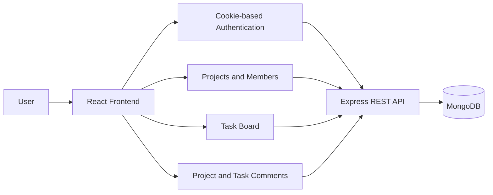
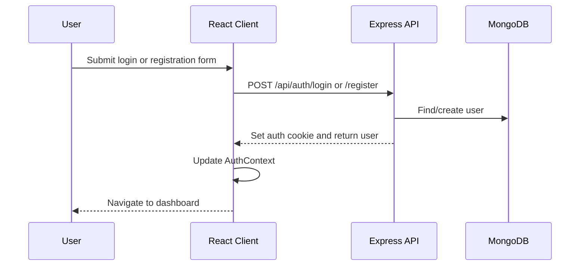

# ProjectFlow

> A full-stack project management workspace for organizing projects, teams, tasks, and collaboration in one place.

ProjectFlow is a TypeScript application with a React frontend and an Express/MongoDB backend. Users can create or join projects, manage project members, organize work on a task board, assign tasks, track status and priority, and collaborate through comments.

## Product Overview



### What you can do

- Register, sign in, restore a session, and sign out.
- Create, search, filter, edit, and delete projects.
- Join a project with an invite code.
- Regenerate and copy project invite codes.
- View project members and remove members as the project owner.
- Create tasks with descriptions, priorities, due dates, and optional assignees.
- Edit, assign, delete, filter, sort, and update task status.
- Add, edit, and delete project comments.
- View dashboard statistics for projects and tasks.
- Use the responsive navigation layout on desktop and mobile.

## Technology Stack

### Frontend

| Technology | Role |
|---|---|
| React 18 | Component-based UI |
| TypeScript | Static typing |
| Vite | Development server and production build |
| React Router | Client-side routing and protected routes |
| Axios | HTTP requests to the backend |
| Tailwind CSS | Responsive styling |
| Lucide React | Interface icons |
| `clsx` + `tailwind-merge` | Conditional and conflict-free class names |
| Class Variance Authority | Button and badge variants |

### Backend

| Technology | Role |
|---|---|
| Node.js + TypeScript | Server runtime and language |
| Express 5 | REST API framework |
| MongoDB + Mongoose | Database and data models |
| Zod | Request-body validation |
| JSON Web Token | Authentication token creation and verification |
| HTTP-only cookie flow | Client/server session transport |
| bcrypt | Password hashing |
| CORS | Frontend/backend origin configuration |
| Socket.IO | Installed for future real-time functionality; no active frontend flow currently depends on it |

## Repository Structure

```text
.
├── client/                         React + Vite frontend
│   ├── src/
│   │   ├── api/                    Axios services for backend requests
│   │   ├── components/             Common, layout, project, task, comment UI
│   │   ├── context/                Authentication and sidebar contexts
│   │   ├── pages/                  Route-level screens
│   │   ├── routes/                 Protected route wrapper
│   │   ├── styles/                 Global Tailwind/CSS entry
│   │   ├── types/                  Shared frontend TypeScript types
│   │   └── utils/                  Error, task, and class-name helpers
│   ├── package.json
│   └── vite.config.ts
├── server/                         Express + MongoDB backend
│   ├── src/
│   │   ├── config/                 Database configuration
│   │   ├── controllers/             HTTP request handlers
│   │   ├── middleware/              Auth, validation, and error middleware
│   │   ├── models/                  Mongoose models
│   │   ├── routes/                  API route definitions
│   │   ├── schemas/                 Zod request schemas
│   │   ├── services/                Business logic
│   │   ├── types/                   Backend TypeScript types
│   │   └── utils/                   JWT helpers
│   ├── package.json
│   └── tsconfig.json
├── docs/
│   └── FRONTEND_ARCHITECTURE.md     Detailed frontend source map
└── README.md
```

## Architecture

### Frontend flow

The frontend mounts in `client/src/main.tsx`. The provider order is:

```text
React.StrictMode
└── BrowserRouter
		└── AuthProvider
				└── SidebarProvider
						└── App
```

`App.tsx` defines public and protected routes. Each protected page currently renders its own `Navbar`, `Sidebar`, and scrollable main area. Page and feature components own most of their local loading, form, modal, and response state.

The two shared contexts are:

- `AuthContext`: current user, auth loading state, login, register, logout, and session checking.
- `SidebarContext`: mobile drawer state and sidebar collapse controls.

The frontend uses a service pattern for network requests:

```text
Page or component
	-> local handler / Context
	-> client/src/api/*.ts
	-> client/src/api/axios.ts
	-> Express /api endpoint
	-> response or error
	-> state update / toast / inline error
	-> React re-render
```

### Backend flow

The backend starts in `server/src/index.ts`, loads environment variables, connects to MongoDB, and starts Express on `PORT` or port `5000`.

```text
HTTP request
	-> CORS, JSON parser, cookie parser
	-> route
	-> protect middleware when required
	-> Zod validation when required
	-> controller
	-> service
	-> Mongoose model
	-> JSON response
	-> centralized error handler when an exception occurs
```

The API is mounted as follows:

- `/api/auth` for authentication.
- `/api/projects` for project and membership operations.
- `/api` for task routes.
- `/api` for comment routes.

## Frontend Pages And Routes

| Route | Page | Access | Purpose |
|---|---|---|---|
| `/login` | `LoginPage` | Public | Sign in to an existing account |
| `/register` | `RegisterPage` | Public | Create an account |
| `/dashboard` | `DashboardPage` | Protected | Project overview and task statistics |
| `/projects` | `ProjectsPage` | Protected | Search, filter, create, edit, delete, or join projects |
| `/projects/:projectId` | `ProjectDetailsPage` | Protected | Project information, members, tasks, and comments |
| `/profile` | `ProfilePage` | Protected | Account details, memberships, and task summary |
| `/settings` | Inline settings screen in `App.tsx` | Protected | Placeholder for workspace preferences |
| `/` | Redirect | Protected | Redirects to `/dashboard` |
| `*` | `NotFoundPage` or redirect | Mixed | Protected 404 screen or public redirect to `/login` |

## Core Features

### Authentication

The frontend sends credentials with Axios using `withCredentials: true`. The backend stores the JWT in a cookie. On startup, `AuthProvider` calls `GET /api/auth/me` to restore the session before protected routes render.



The backend `protect` middleware reads `req.cookies.token`, verifies the JWT, loads the current user, and attaches that user to the request. Requests without a valid token return `401`.

Frontend auth files:

- `client/src/context/AuthContext.tsx`
- `client/src/pages/LoginPage.tsx`
- `client/src/pages/RegisterPage.tsx`
- `client/src/routes/ProtectedRoute.tsx`
- `client/src/api/auth.ts`
- `client/src/api/axios.ts`

Backend auth files:

- `server/src/routes/auth.routes.ts`
- `server/src/controllers/auth.controller.ts`
- `server/src/services/auth.service.ts`
- `server/src/middleware/auth.middleware.ts`
- `server/src/schemas/auth.schema.ts`
- `server/src/utils/jwt.ts`

### Projects And Members

Projects are loaded with `GET /api/projects`. Owners can create, update, delete, and regenerate invite codes. Any authenticated user can join with a valid invite code. Project details load the project and member list together, then pass members into member cards, task forms, and assignment controls.

```mermaid
flowchart TD
		ProjectsPage --> ProjectService[project.ts]
		ProjectService --> ProjectAPI[/api/projects]
		ProjectAPI --> ProjectState[projects state]
		ProjectState --> Cards[ProjectCard components]
		Cards --> Details[/projects/:projectId]
		Details --> MembersAPI[/api/projects/:id/members]
		MembersAPI --> Members[MemberCard components]
		Members --> TaskBoard[TaskBoard member data]
```

### Tasks

Tasks are presented as four status columns:

```text
Todo -> In Progress -> Review -> Done
```

`TaskBoard` owns task fetching, filtering, sorting, modal state, and mutations. Task permissions shown in the UI are based on ownership and assignment:

- Owners can edit, delete, assign, and change any task status.
- Assigned members can change the status of tasks assigned to them.
- Task creation supports title, description, priority, due date, and optional assignment.

Task API operations include:

| Method | Endpoint | Purpose |
|---|---|---|
| `GET` | `/api/projects/:projectId/tasks` | List project tasks |
| `GET` | `/api/tasks/:taskId` | Get one task |
| `POST` | `/api/projects/:projectId/tasks` | Create a task |
| `PATCH` | `/api/tasks/:taskId` | Edit task details |
| `PATCH` | `/api/tasks/:taskId/assign` | Assign a member |
| `PATCH` | `/api/tasks/:taskId/status` | Change task status |
| `DELETE` | `/api/tasks/:taskId` | Delete a task |

### Comments

The current frontend uses project-level comments in `ProjectDetailsPage`. The backend also exposes task-level comment routes for future or other clients.

| Method | Endpoint | Purpose |
|---|---|---|
| `GET` | `/api/projects/:projectId/comments` | List project comments |
| `POST` | `/api/projects/:projectId/comments` | Add a project comment |
| `GET` | `/api/tasks/:taskId/comments` | List task comments |
| `POST` | `/api/tasks/:taskId/comments` | Add a task comment |
| `PATCH` | `/api/comments/:commentId` | Edit a comment |
| `DELETE` | `/api/comments/:commentId` | Delete a comment |

## API Reference

### Authentication

| Method | Endpoint | Auth | Description |
|---|---|---|---|
| `POST` | `/api/auth/register` | No | Register a user |
| `POST` | `/api/auth/login` | No | Log in and set the auth cookie |
| `POST` | `/api/auth/logout` | No | Clear/logout the session |
| `GET` | `/api/auth/me` | Yes | Return the current user |

### Projects

| Method | Endpoint | Auth | Description |
|---|---|---|---|
| `POST` | `/api/projects` | Yes | Create a project |
| `GET` | `/api/projects` | Yes | List accessible projects |
| `GET` | `/api/projects/:projectId` | Yes | Get project details |
| `PATCH` | `/api/projects/:projectId` | Yes | Update project details |
| `DELETE` | `/api/projects/:projectId` | Yes | Delete a project |
| `POST` | `/api/projects/join` | Yes | Join using an invite code |
| `POST` | `/api/projects/:projectId/leave` | Yes | Leave a project |
| `GET` | `/api/projects/:projectId/members` | Yes | List project members |
| `DELETE` | `/api/projects/:projectId/members/:memberId` | Yes | Remove a member |
| `PATCH` | `/api/projects/:projectId/invite-code` | Yes | Regenerate invite code |

All protected routes require the authentication cookie. Request bodies are validated by the relevant Zod schema before the controller runs.

## Validation And Error Handling

Backend request validation is centralized through `validate()` middleware. Invalid bodies return a response shaped like:

```json
{
	"success": false,
	"message": "Validation failed",
	"errors": [
		{ "field": "email", "message": "Invalid email address" }
	]
}
```

Frontend forms also perform lightweight local checks before requests. The frontend error helper in `client/src/utils/error.ts` looks for `response.data.message`, `response.data.error`, and `response.data.errors`, then falls back to `Something went wrong`.

The server's final `errorHandler` is mounted after all routes. Authentication failures are returned directly by `protect` with status `401`; validation failures return `400`.

## Getting Started

### Prerequisites

- Node.js 18 or newer recommended.
- npm.
- A running MongoDB database or MongoDB Atlas connection string.

### 1. Configure the backend

Create `server/.env`:

```env
PORT=5000
MONGO_URI=mongodb://127.0.0.1:27017/projectflow
CLIENT_URL=http://localhost:5173
JWT_SECRET=replace-with-a-long-random-secret
```

Use the variable names expected by the backend configuration and JWT utility. Do not commit real secrets.

### 2. Install and run the server

```bash
cd server
npm install
npm run dev
```

The API is available at `http://localhost:5000`. The root endpoint returns `Server is running`.

For a production-style build:

```bash
npm run build
npm start
```

### 3. Configure and run the client

Create `client/.env` if the backend is not running at the default URL:

```env
VITE_BACKEND_URL=http://localhost:5000
```

Then run:

```bash
cd client
npm install
npm run dev
```

Open the Vite URL shown in the terminal, normally `http://localhost:5173`.

### Available scripts

#### Client

| Command | Purpose |
|---|---|
| `npm run dev` | Start the Vite development server |
| `npm run build` | Type-check and build the frontend |
| `npm run preview` | Preview the production build |

#### Server

| Command | Purpose |
|---|---|
| `npm run dev` | Start the server with Nodemon |
| `npm run build` | Compile TypeScript to `dist/` |
| `npm start` | Start the compiled server |
| `npm test` | Placeholder; no automated tests are currently configured |

## Environment Variables

| Variable | Used by | Purpose |
|---|---|---|
| `MONGO_URI` | Server | MongoDB connection string; required |
| `JWT_SECRET` | Server JWT utility | Secret used to sign and verify tokens |
| `PORT` | Server | HTTP port; defaults to `5000` |
| `CLIENT_URL` | Server CORS | Allowed frontend origin; defaults to `http://localhost:5173` |
| `VITE_BACKEND_URL` | Client | Backend origin; defaults to `http://localhost:5000` |

## Security Notes

- Passwords are hashed with bcrypt on the backend.
- Protected API routes validate a JWT from the `token` cookie.
- CORS is configured with credentials enabled and a specific client origin.
- Never commit `.env` files, database credentials, or JWT secrets.
- Backend authorization remains the source of truth even when the frontend hides owner-only controls.

## Documentation

For a detailed, source-by-source explanation of the frontend, see:

- [Frontend Architecture Guide](docs/FRONTEND_ARCHITECTURE.md)

That guide covers component relationships, context providers, routes, API services, task flows, modal behavior, loading states, error handling, responsive behavior, and debugging locations.

## Current Limitations

The following areas are present as placeholders or are not fully wired in the current codebase:

- Settings is a static placeholder screen.
- Forgot password is not implemented.
- Google authentication buttons are visual only.
- Remember me is not connected to state or persistence.
- Navbar notifications are visual only.
- The frontend uses project comments; task comment endpoints exist on the backend but are not currently rendered by the frontend.
- Socket.IO is installed but no active real-time update flow is documented in the current frontend.
- No automated test suite is configured in the package scripts.

## License

This project currently uses the repository's existing ISC package metadata. Add project-specific licensing terms here if the distribution requirements change.
